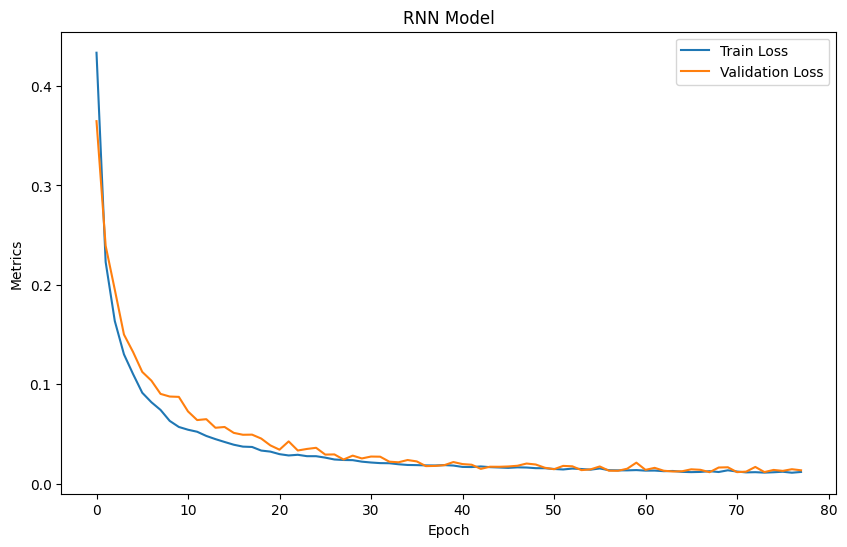
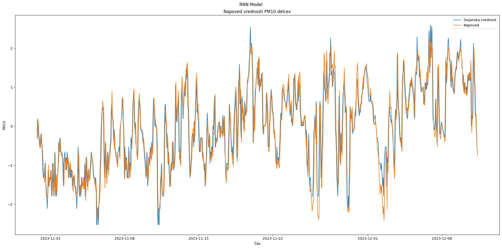
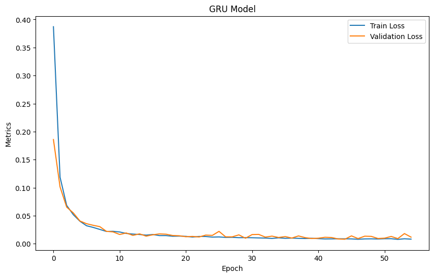
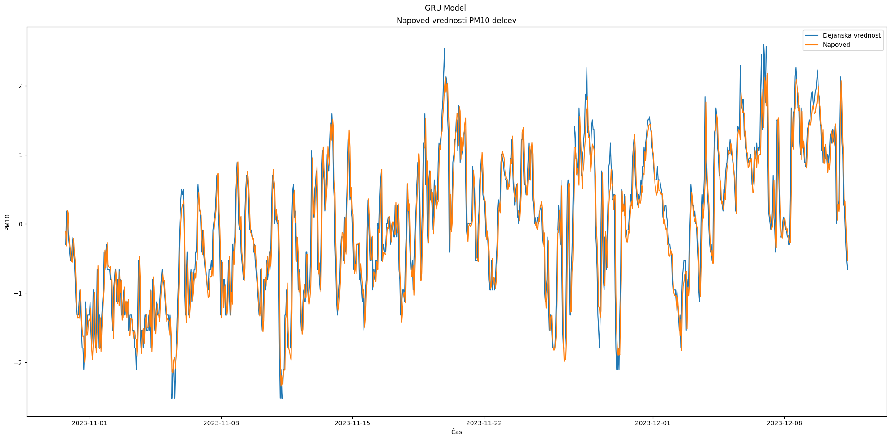
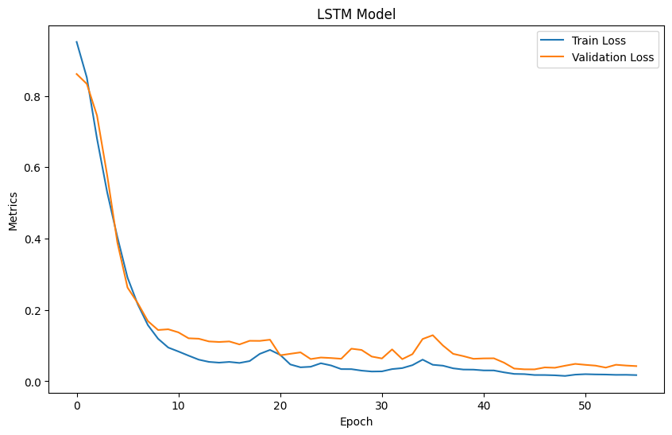
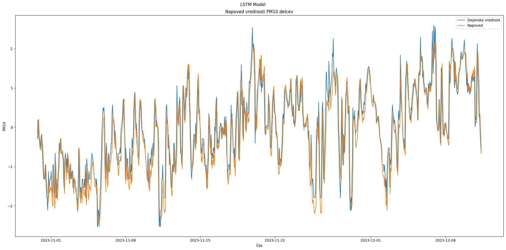

# Predicting PM10 Air Particles Using Recurrent Neural Networks (RNN, GRU, LSTM)

## RNN
### Architecture
```python
model_rnn = Sequential([
    SimpleRNN(128, input_shape=input_shape, return_sequences=True),
    Dropout(0.2),
    SimpleRNN(64, return_sequences=True),
    Dropout(0.2),
    SimpleRNN(64),
    Dense(64, activation='relu'),
    Dense(1)
])

model_rnn.compile(optimizer=Adam(learning_rate=0.0004), loss='mean_squared_error')
early_stopping = EarlyStopping(monitor='val_loss', patience=10, restore_best_weights=True)
history_rnn = model_rnn.fit(X_train, y_train, epochs=100, validation_split=0.2, verbose=1, callbacks=[early_stopping])
```

### Training History


### Predictions


## GRU
### Architecture
```python
model_gru = Sequential([
    GRU(128, input_shape=input_shape, return_sequences=True),
    Dropout(0.2), 
    GRU(64, return_sequences=True),
    Dropout(0.2),
    GRU(32), 
    Dense(32, activation='relu'),
    Dense(1)
])

model_gru.compile(optimizer=Adam(learning_rate=0.0004), loss='mean_squared_error')
early_stopping = EarlyStopping(monitor='val_loss', patience=10, restore_best_weights=True)
history_gru = model_gru.fit(X_train, y_train, epochs=100, validation_split=0.2, verbose=1, callbacks=[early_stopping])
```

### Training History


### Predictions


## LSTM
### Architecture
```python
model_lstm = Sequential([
    LSTM(128, input_shape=input_shape, return_sequences=True),
    Dropout(0.2),
    LSTM(64, return_sequences=True),
    Dropout(0.2),
    LSTM(32),
    Dense(32, activation='relu'),
    Dense(1)
])

model_lstm.compile(optimizer=Adam(learning_rate=0.0004), loss='mean_squared_error')
early_stopping = EarlyStopping(monitor='val_loss', patience=10, restore_best_weights=True)
history_lstm = model_lstm.fit(X_train, y_train, epochs=100, validation_split=0.2, verbose=1, shuffle=False, callbacks=[early_stopping])
```

### Training History


### Predictions
